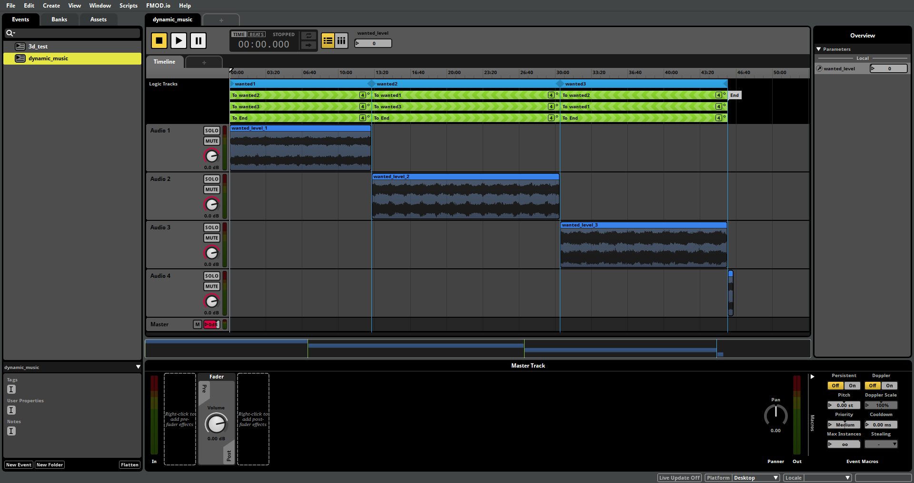
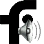

# FMOD Studio
<figure markdown>
  { width="1920" }
  <figcaption>FMOD STUDIO APP showcase</figcaption>
</figure>

FMOD is a proprietary sound effects engine and authoring tool for video games and applications developed by Firelight Technologies, that play and mix sounds of diverse formats on many operating systems.

!!! note

    we implemented FMOD Studio inside of Hunt Down the freeman to allow us the following 

    - ***the use of other file formats like .ogg***
    - ***the abbilty to allow for dynamic music***
    - ***the use of more up to date tools***
    - ***and many more things***

## logic_fmod_music

<figure markdown>
 {width="200" loading=lazy }
 <figcaption>FMOD Enitity icon used by hammer</figcaption>
</figure>
we curently have a new entity inside of Hunt Down the Freeman

its called `logic_fmod_music`

we use this entity to allow us to edit paramteres with hammer I/O with paramteres that are defined inside of FMOD Studio

the entity has the following parameters

- BankFile - this refers to the bank file that you want to use located inside of `sound\fmod`

### KEYS

- Name targetname <target_source\> - The name that other entities refer to this entity by.

- BankFile BankFile <string\> - BankFile to import.

- EventName Event_path <string\> - Name of Event

- Is Loaded From VPK IsLoadedFromVPK <choices\> - if the files for fmod are loaded from a vpk file

- Param 1 SetparamName1 <string\> - Param 1 Name

- Param 2 SetparamName2 <string\> - Param 2 Name

- Param 3 SetparamName3 <string\> - Param 3 Name

- Param 4 SetparamName4 <string\> - Param 4 Name

### INPUTS
- Start - Start the audio

- Stop - Stop the audio

## Basics
we will not be covering how to use fmod studio in this section.

If you want to learn more please take a look at this playlist on youtube for more info

<iframe style=" display: block;
    margin-left: auto;
    margin-right: auto"
   width="560" height="315" src="https://www.youtube.com/embed/videoseries?list=PLcZl-HDwmxfNbiDsLZNFUviHe4dP56vqE" title="YouTube video player" frameborder="0" allow="accelerometer; autoplay; clipboard-write; encrypted-media; gyroscope; picture-in-picture; web-share" allowfullscreen></iframe>

**another great tutorial explaining how fmod works**

<iframe style=" display: block;
    margin-left: auto;
    margin-right: auto"
     width="560" height="315" src="https://www.youtube.com/embed/7A1HMOsD2eU" title="YouTube video player" frameborder="0" allow="accelerometer; autoplay; clipboard-write; encrypted-media; gyroscope; picture-in-picture; web-share" allowfullscreen></iframe>

## Basic tutorial for hammer

After you have made you'r epic music track we now need to build the bank files you will need to go to fmod studio and inside of the ``edit -> preferences -> build`` tab

we need to configure the output path of the bank file which is usually ``sound/fmod/mapname_here`` 

here is and example screenshot 

<figure markdown>
 
 <figcaption>Example of how the build tab should look</figcaption>
</figure>

next after we build our bank files we need to specify the name of the bank inside of hammer itself

my bank is named `dynamic_music` so i will just add the name to the entity's keyfield like here in this screenshot:

next we need to specify the event name you can get the event name by exporting the guids from fmod studio itself you can do that by going into fmod studio then ``File -> Export GUIDs...``

you will now see a ``GUIDs.txt`` file inside of the folder where you built your banks

here is a screenshot of the .txt file:

as you can see we have 2 events now i want to use the ``event:/dynamic_music`` event

next we specify the EventName in the entity with the event we want to use

here is an example screenshot:

next we need to specify the parameter we want to be abel to manipulate using Hammer I/O 

we will take another look at the GUIDs.txt file and we see that we have a parameter named ``parameter:/wanted_level`` we will add that to the Param 1 field 

example screenshot:

**WE ARE ALMOST DONE!!**

next we need to just make the music start from the entity we can use a logic_auto to fire a start output on our fmod entity

example screenshot:

!!! note

    make sure to make the output be fired after 
    ``2 seconds``   as the bank might not load fully on map spawn so be   careful. 

    I would highly recommend you start the fmod entity  sometime later in your map so you are always sure that  it`s loaded properly!

next we will make a combine soldier and after We kill him we will make the fmod entity set the ``parameter:/wanted_level`` param to be equal to `1` which will make our music change!

example screenshot:

***AND WE ARE DONE!***

**now lets compile our map and check out the results**

here is a video of it in action:

<iframe style=" display: block;
    margin-left: auto;
    margin-right: auto"
   width="560" height="315" src="https://www.youtube.com/embed/Aq8MxwjXIXI" title="YouTube video player" frameborder="0" allow="accelerometer; autoplay; clipboard-write; encrypted-media; gyroscope; picture-in-picture; web-share" allowfullscreen></iframe>

### Final Notes

we also support loading the bank files from a ``VPK``

all you need to do is put the bank files in a vpk and set ``IS Load From VPK`` to ``Yes`` inside the KeyField of the entity

remember that the path inside the vpk should be the same

example: ``sound/fmod/<your map name here\>``

you can put your vpk file in the custom folder and Voilà
it will work just like magic

if you have any more questions feel free to join the hdtf disocrd here:

[HDTF Community Discord Server](https://discord.gg/hdtf){ .md-button .md-button--primary }



***Thank you for reading!***

!!! note
    
    THIS PAGE IS A HEAVY WIP MORE STUFF WILL BE ADDED TO IT IN THE FUTURE